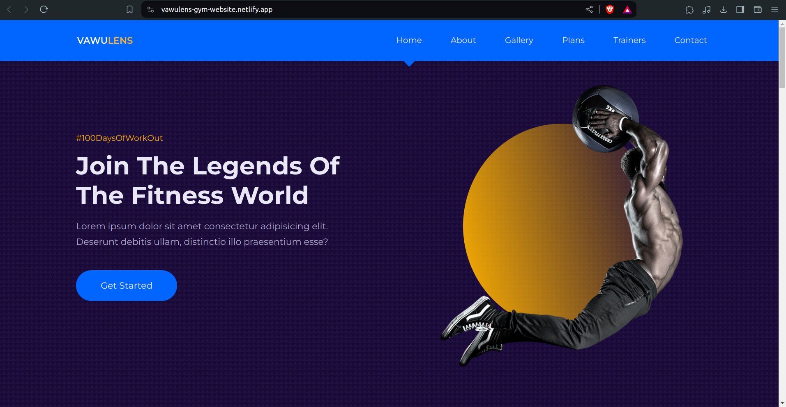

<h1 align="center">VAWULENS - A gym landing page</h1>
<p align="center">
  
</p>

<div align="center"><h4>This is a visually appealing and informative gym landing page built with React. It showcases the gym's services, facilities, and promotes membership sign-ups.</h3></div>

## Technology used: 


## Project Setup

1. **Clone the repository**
```
git clone https://github.com/Thanisha23/Gym-Website.git
```

2. **Navigate to the project directory and install dependencies for the project**

 ```
pnpm install
```
3. **Start the frontend development server**
```
npm run start
```


<div align="center"><h4>If you like the project don't forget to give it a star ⭐</h4></div>
